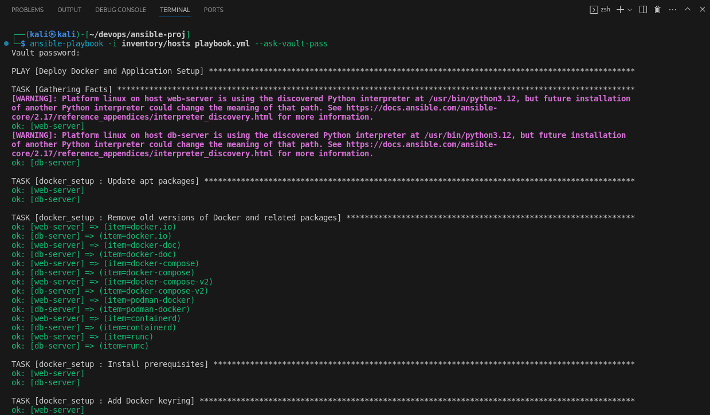
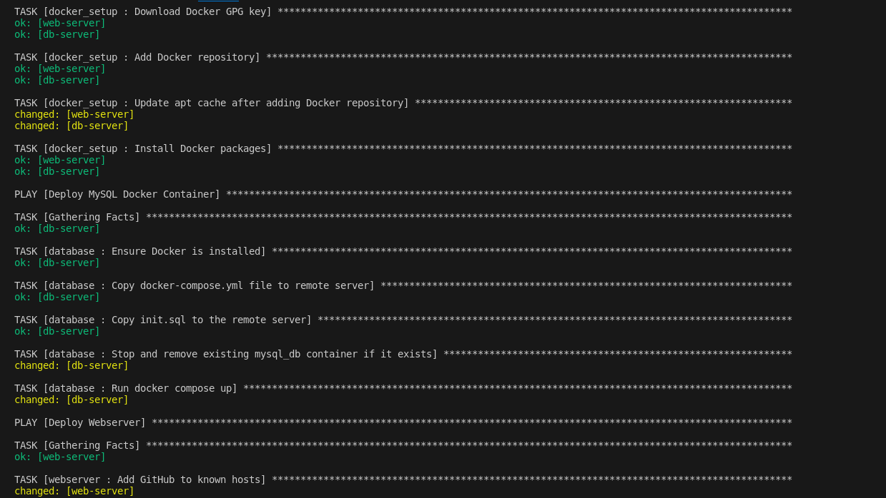
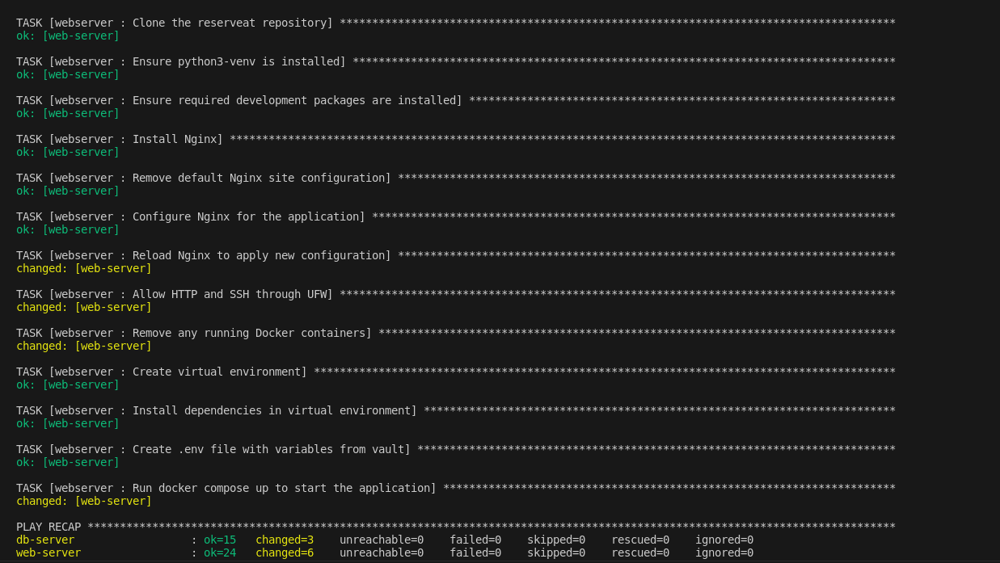
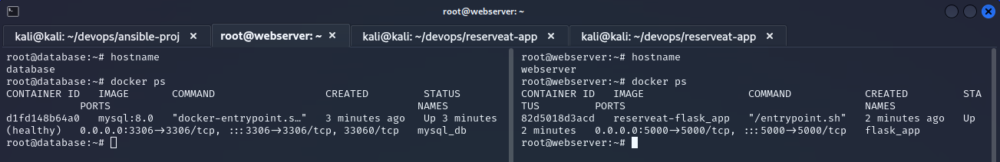
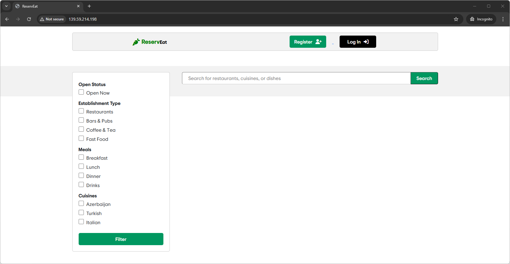

# Ansible Deployment for Dockerized Web Application

This project automates the deployment of a Dockerized web application using Ansible. The playbook sets up both a MySQL database server and a web server running Nginx, Docker, and the application. It includes multiple roles to complete the task.

---

## **Roles**

### 1. **docker_setup**
This role installs DockerCE on the remote servers (both webserver and database server). It ensures the system is ready to run Docker containers.

- **Files:**
  - `roles/docker_setup/tasks/main.yml`: Contains tasks to install Docker and Docker Compose.

### 2. **database**
This role deploys a MySQL Docker container. It also configures the database with necessary initialization scripts and creates the required db schema for the web app.

- **Files:**
  - `roles/database/tasks/main.yml`: Installs MySQL, sets up Docker containers for MySQL, and initializes the database with `init.sql`.
  - `roles/database/templates/docker-compose.yml`: Docker Compose configuration for MySQL container.

### 3. **webserver**
This role deploys the web server (Nginx) and the web application. It also sets up a virtual environment, installs dependencies, and configures the application and UFW firewall.

- **Files:**
  - `roles/webserver/tasks/main.yml`: Handles the setup of Nginx, Docker containers, and the Python environment.
  - `roles/webserver/templates/wapp`: Nginx site configuration for the web application.
  - `roles/webserver/templates/env_file.j2`: Template for the `.env` file used by the application.

---

## **Files**

### 1. **`group_vars/all/vault.yml`**
This file stores sensitive variables, such as database credentials, db server IP address, port number, database name, and the secret key used by the web application, which is securely encrypted using Ansible Vault. Ensure the Vault file contains all the necessary secrets for your application.

- **Sample:**
  ```yaml
    mysql_host: 1.2.3.4
    mysql_db_name: reserveat
    mysql_user: webadmin
    mysql_user_password: example_pass
    secret_key: reserveat
    mysql_root: root
    mysql_root_password: example_pass
  ```

**How to edit the vault file:**
If you need to edit the Vault file, use the following command to decrypt and edit it:
```bash
ansible-vault edit group_vars/all/vault.yml # admin123
```
You will be prompted to enter the vault password.

### 2. **`inventory/hosts`**
This file contains the list of remote servers and their corresponding configurations. It defines the IP addresses and user information for both the web and database servers.

- **Example:**
  ```ini
  [webserver]
  web-server ansible_host=webserver_ip_adrs ansible_user=root

  [database]
  db-server ansible_host=database_ip_adrs ansible_user=root
  ```

### 3. **`playbook.yml`**
This is the main Ansible playbook that orchestrates the deployment. It defines the tasks for deploying the Docker setup, database, and web server.

- **playbook.yml:**
  ```yaml
    - name: Setup Docker
    hosts: all
    become: yes
    roles:
        - docker_setup

    - name: Deploy MySQL Docker Container
    hosts: db-server
    become: yes
    vars_files:
        - group_vars/all/vault.yml
    roles:
        - database

    - name: Deploy Webserver
    hosts: webserver
    become: yes
    vars_files:
        - group_vars/all/vault.yml
    roles:
        - webserver
  ```

---

## **How to Run the Playbook**

1. **Prepare the servers**: Ensure the target servers (both web server and database server) are accessible via SSH and have the necessary permissions.

2. **Ensure SSH keys**: Ensure that the web server has SSH keys configured for GitHub access if you are cloning a private repository.

3. **Edit the Vault file**: Modify the `vault.yml` to change the default creds and include your database server IP address.
    ```bash
    group_vars/all/vault.yml
    ```
    * Set a strong password for the vault
    * Change secrets stored in the vault to production-friendly strong ones
    * Do not forget to include the actual IP address of your database server


4. **Edit the Hosts file**: Modify the `inventory/hosts` to define the actual IP addresses of your web and database servers.
    ```bash
    inventory/hosts
    ```

5. **Run the playbook**:
   To provide passwordless SSH authentication:
   ```bash
   # To copy local public key to the remote servers authorized_keys file.
   ssh-copy-id root@database-server-ip
   ssh-copy-id root@web-server-ip
   ```

   Execute the playbook with the following command:
   ```bash
   ansible-playbook -i inventory/hosts playbook.yml --ask-vault-pass
   ```

   This will deploy the necessary configurations and start the application.

---

## **Expected Output**

- 
- 
- 

---

## **Containers Created on the Remote Servers**:

- 

## **End Result**
  When navigated to the `http://webserver_ip/`
- 